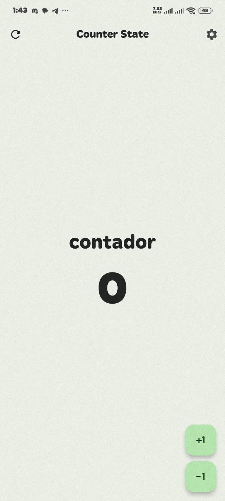
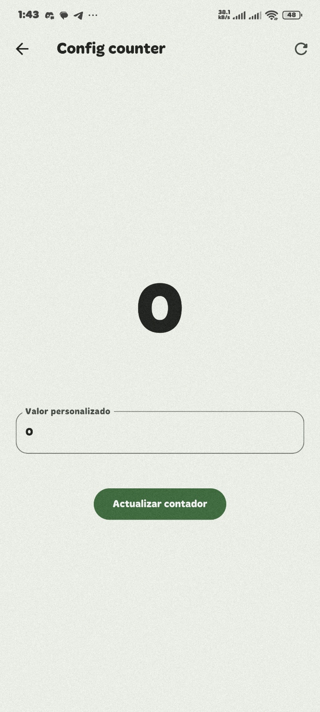
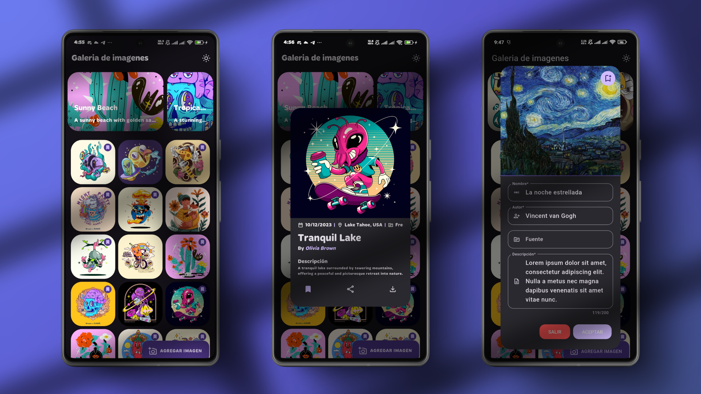

# Flutter State Management Projects 🚀

Este repositorio contiene una colección de proyectos diseñados para aprender y practicar los diferentes manejadores de estado en Flutter. Cada proyecto aborda un caso de uso específico y aumenta en complejidad para ayudar a dominar el estado en Flutter.

---

## Proyectos por Manejador de Estado 📂

### 1. **StatefulWidget** 🧩

Proyectos básicos que utilizan `StatefulWidget` y `setState` para manejar el estado local.

1. **Contador con múltiples pantallas**

     
     

   - Un contador que mantiene su valor al navegar entre pantallas.
   

2. **Galería de imágenes local**

      

   - Selecciona imágenes de una lista y muéstralas en una nueva vista.
   - Agregue nuevas imagenes a las ya existentes
   - TODO: Obtener metadata de la imagen

3. **Formulario de registro**
   - Validación de campos como nombre, correo y contraseña en tiempo real.
   - 🚧 _Espacio para imágenes del proyecto._

---

### 2. **Provider** 🛠️

Proyectos que implementan `Provider` para manejar el estado global de manera eficiente.

1. **Lista de tareas con categorías**

   - Cada categoría tiene su propia lista de tareas.

2. **Gestión de inventario**

   - Agregar, editar y eliminar productos con stock disponible.

3. **Calculadora de propinas**
   - Ajustar el porcentaje de propina y dividir el total entre varias personas.

---

### 3. **Riverpod** 🌊

Proyectos que exploran `Riverpod` para manejar el estado reactivo y dependencias.

1. **Aplicación de clima avanzada**

   - Soporte para múltiples ubicaciones y predicciones semanales.

2. **Lista de reproducción de música**

   - Agregar canciones, marcarlas como favoritas y reproducirlas.

3. **Búsqueda de películas**
   - Integración con una API para buscar y guardar películas favoritas.

---

### 4. **Bloc/Cubit** ⚡

Proyectos que implementan el patrón Bloc para manejar estados complejos con eventos y transiciones.

1. **Flujo de autenticación completo**

   - Registro, inicio de sesión y recuperación de contraseñas.

2. **Gestión de proyectos**

   - Crear proyectos con tareas, asignar miembros y actualizar el progreso.

3. **Chat en tiempo real**
   - Simular un chat con mensajes enviados y recibidos.

---

### 5. **GetX** ⚙️

Proyectos que usan `GetX` para manejar estado reactivo y simplificar la navegación.

1. **Galería de fotos con favoritos**

   - Permitir a los usuarios marcar fotos como favoritas y verlas en una lista separada.

2. **App de noticias**

   - Mostrar noticias en diferentes categorías con navegación fluida.

3. **Temporizador personalizado**
   - Crear y gestionar múltiples temporizadores.

---

### 9. **InheritedWidget** 🏗️

Proyectos que comparten datos a través del árbol de widgets con `InheritedWidget`.

1. **Configuración global de idioma**

   - Cambiar el idioma de la app en tiempo real.

2. **Tema personalizado por usuario**

   - Permitir a los usuarios elegir colores y fuentes.

3. **Estado de conexión**
   - Mostrar un indicador global cuando no hay conexión a internet.

---

## Contribuciones 🛠️

¡Las contribuciones son bienvenidas! Si tienes ideas para mejorar los proyectos o agregar nuevos, no dudes en abrir un PR o crear un issue.

---

## Licencia 📜

Este repositorio está bajo la Licencia MIT. ¡Siéntete libre de usarlo y adaptarlo a tus necesidades!

---

## Contacto ✉️

Para dudas o sugerencias, puedes contactarme en [josepuello112000@ejemplo.com](mailto:tu-email@ejemplo.com).
